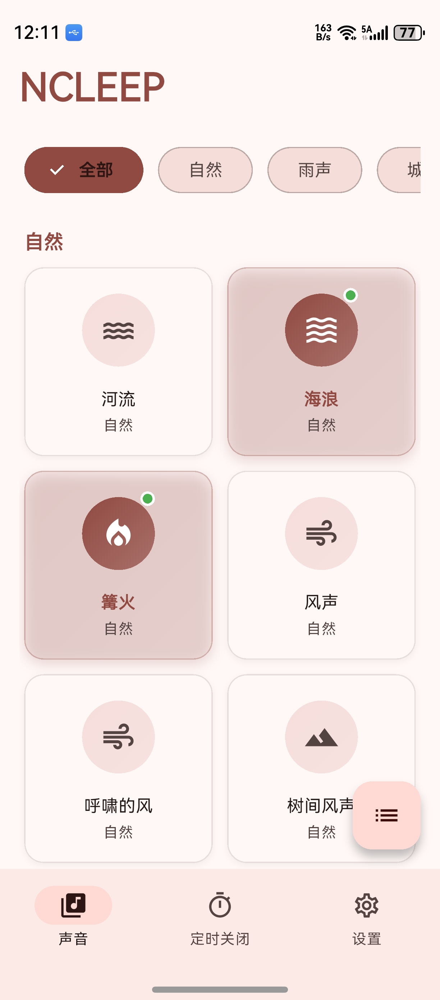
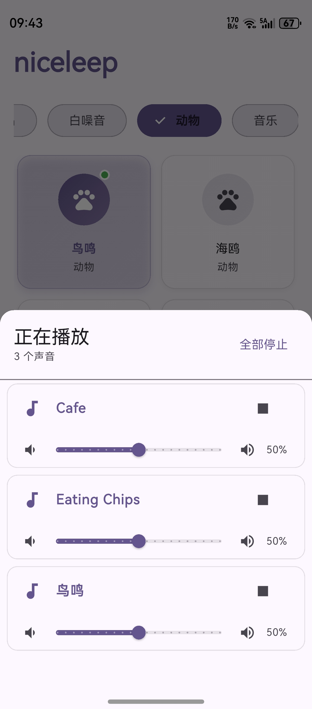
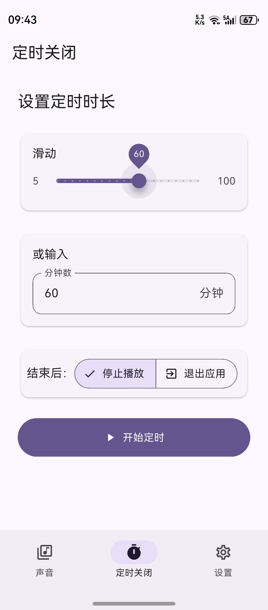
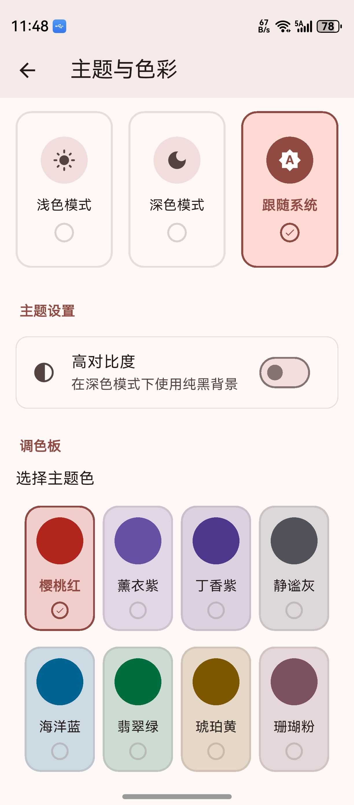

# 响入睡

[XMSLEEP](https://github.com/Tosencen/XMSLEEP)的flutter copy版

安卓建议直接用原版[XMSLEEP](https://github.com/Tosencen/XMSLEEP)

安装包200m是音频占了160m

## 目前打包的平台

- [x] Android
- [x] HarmonyOS

其中鸿蒙版已上架：[商店链接](https://appgallery.huawei.com/app/detail?id=com.qshh.niceleep&channelId=LAUNCHERSHARE)

## 📱 截图

<table>
  <tr>
    <td align="center">
      
    </td>
    <td align="center">
      
    </td>
  </tr>
  <tr>
    <td align="center">
      
    </td>
    <td align="center">
      
    </td>
  </tr>
</table>

---

# 致谢

- [XMSLEEP](https://github.com/Tosencen/XMSLEEP)
- 等等

# 开源协议: [MIT](LICENSE)
